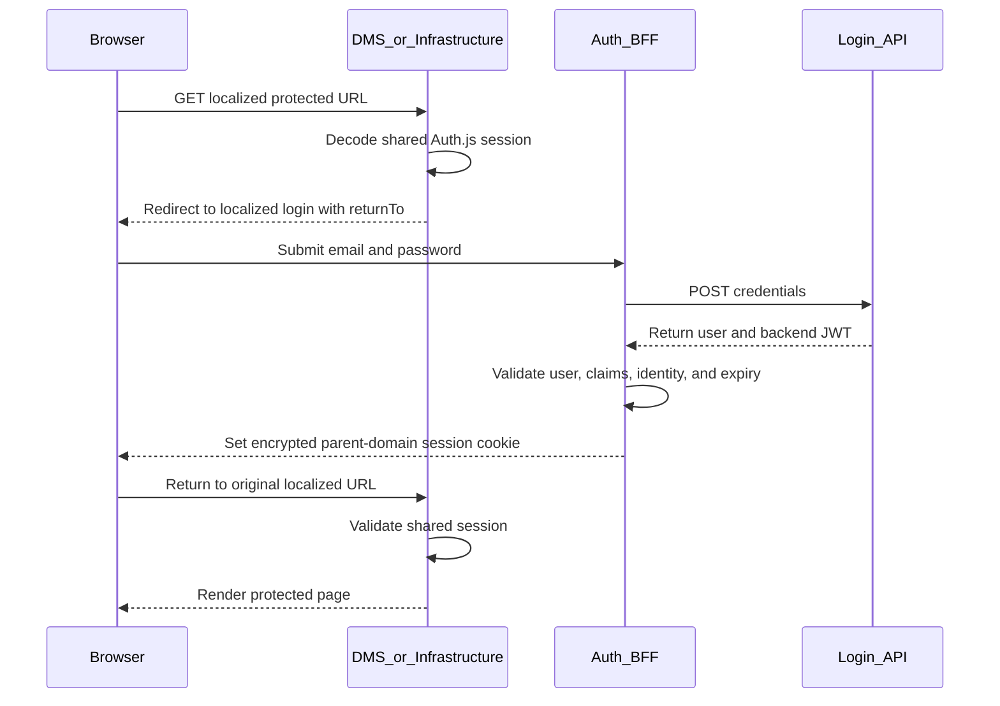

# Authentication architecture

## Executive summary

Authentication is centralized in the `auth` application. DMS and
infrastructure never receive passwords and do not expose Auth.js handlers.
They read one encrypted, parent-domain Auth.js session through the shared
`@workspace/auth` package.

This provides single sign-on across trusted sibling applications:

1. A user visits DMS or infrastructure.
2. The service detects that no valid shared session exists.
3. The user is redirected to the localized auth login page.
4. The auth BFF sends the credentials to the external backend.
5. A validated backend identity and bearer token are stored in an encrypted
   Auth.js session cookie.
6. The browser sends that parent-domain cookie to both protected services.

The design centralizes credential handling, but it also makes every app with
the shared cookie secret part of one security boundary.

## Authentication and authorization

These terms describe different decisions:

- **Authentication** answers “Who is this user?” In this project, login,
  session decoding, identity validation, and logout are authentication.
- **Authorization** answers “May this user perform this operation?” Module
  and permission claims support authorization, but application operations
  and the backend must enforce those decisions.

A valid session is not proof that every action is allowed.

## Auth concepts used in this platform

### Credentials authentication

Credentials authentication collects an email and password and verifies them
against an identity backend. The browser posts the form to a server action
in the auth app. The auth app calls the backend server-to-server, so DMS and
infrastructure never process passwords.

This is the currently implemented method. It does not provide federated
identity, social login, or enterprise identity-provider discovery.

### Backend for Frontend

The auth app is a BFF because it translates browser-facing authentication
into the backend API contract. It:

- Validates browser form input.
- Calls `AUTH_LOGIN_URL`.
- Validates the backend response.
- Converts the backend identity into an Auth.js user.
- Creates and removes the browser session.
- Controls safe post-login and post-logout redirects.

### Backend bearer JWT

The external backend returns a token containing identity, module,
permission, issuance, and expiry claims. This token is intended for
server-to-server authorization when future BFF Route Handlers call backend
APIs.

The bearer token is never returned by the Auth.js session callback and must
never be passed to a Client Component.

### Auth.js JWT session

Auth.js uses a JWT session strategy, but its session token is not simply the
backend JWT. Auth.js encrypts its token as a JWE using `AUTH_SECRET`. The
encrypted payload contains the backend token and validated claims.

The distinction is important:

- The **backend JWT** is an API credential issued by the backend.
- The **Auth.js JWE** is the browser session issued by the auth BFF.

### Shared cookie

The Auth.js JWE is stored in one `HttpOnly` parent-domain cookie:

- Local HTTP name: `platform.session-token`.
- Production HTTPS name: `__Secure-platform.session-token`.
- Domain: configured parent domain, locally `platform.test`.
- Path: `/`.
- SameSite: `Lax`.
- Secure: enabled when `AUTH_APP_URL` uses HTTPS.

Only the session cookie is shared. Auth.js CSRF and other transient cookies
retain their default host-only behavior on the auth service.

## Common authentication approaches

### Database-backed server sessions

The browser stores an opaque session ID and the server loads session state
from a database.

- Strength: immediate server-side revocation and small cookies.
- Cost: shared session storage and a network lookup.
- Current status: not used.

### Signed JWT sessions

The browser stores readable claims protected against modification by a
signature.

- Strength: stateless validation.
- Cost: payload is visible to the browser and revocation is difficult.
- Current status: the backend issues a signed JWT, but it is kept inside the
  encrypted Auth.js session.

### Encrypted JWT or JWE sessions

The browser stores claims protected for confidentiality and integrity.

- Strength: stateless session sharing without exposing the backend token.
- Cost: revocation and permission freshness remain difficult; cookie size is
  limited.
- Current status: used by Auth.js for the platform session.

### OAuth 2.0 and OpenID Connect

The application delegates identity to an authorization server or enterprise
identity provider.

- Strength: standards-based SSO, federation, and reduced password handling.
- Cost: requires an identity provider and callback/token lifecycle design.
- Current status: not implemented.

### Credentials plus BFF

The application accepts credentials at one controlled server and calls an
existing login API.

- Strength: fits the current backend contract and centralizes password
  handling.
- Cost: the platform still participates in password authentication and must
  rely on backend rate limiting and security.
- Current status: implemented.

## Implemented login flow

### Step 1: Navigation gate

[`packages/auth/src/proxy.ts`](../../packages/auth/src/proxy.ts) composes
canonical-host routing, next-intl routing, and the shared session check.
Locale canonicalization runs first, so the eventual `returnTo` contains
`/en` or `/ar`.

[`apps/dms/proxy.ts`](../../apps/dms/proxy.ts) and
[`apps/infrastructure/proxy.ts`](../../apps/infrastructure/proxy.ts) use this
shared proxy. Their static matchers exclude framework assets and API paths.

### Step 2: Safe login redirect

[`packages/auth/src/redirects.ts`](../../packages/auth/src/redirects.ts)
builds localized auth URLs. A `returnTo` is accepted only when its exact
`URL.origin` exists in `AUTH_ALLOWED_ORIGINS`.

Suffix and substring checks are intentionally not used. For example,
`https://dms.platform.test.attacker.example` is not equal to
`https://dms.platform.test`.

The first configured allowed origin is the safe fallback destination.

### Step 3: Credential handling

[`apps/auth/app/[locale]/login/page.tsx`](../../apps/auth/app/%5Blocale%5D/login/page.tsx)
renders the localized form.
[`apps/auth/app/[locale]/actions.ts`](../../apps/auth/app/%5Blocale%5D/actions.ts)
submits through Auth.js.

[`apps/auth/auth.ts`](../../apps/auth/auth.ts):

1. Validates email and password shape with Zod.
2. Sends `{ email, password }` to `AUTH_LOGIN_URL` with `cache: "no-store"`.
3. Uses a generic credentials error for invalid input or rejected login.
4. Passes a successful body to the shared claim validator.

### Step 4: Backend response validation

[`packages/auth/src/claims.ts`](../../packages/auth/src/claims.ts) validates:

- The backend user shape.
- Active account state.
- Numeric backend user ID.
- Email and identity fields.
- Token `id`, `email`, `modules`, `permissions`, `iat`, and `exp`.
- Equality between response user ID/email and token ID/email.
- Backend-token expiry.

The numeric backend ID is converted to a string for Auth.js `User.id`.

### Step 5: Session creation

The Auth.js JWT callback stores:

- The validated backend user.
- The backend bearer token.
- Backend-token expiry.
- Validated modules and permissions.

Auth.js encrypts this token before it is written to the shared cookie.

The browser-facing session callback returns selected safe fields and module
claims. It does not return the backend bearer token or the user's private
email and phone fields.

### Step 6: Session consumption

[`packages/auth/src/session.ts`](../../packages/auth/src/session.ts) provides:

- `getAuthToken(request?)`: returns the validated server-only token,
  including the backend bearer token.
- `getCurrentUser(request?)`: returns the backend user and modules without
  requiring client session state.
- `requireCurrentUser(request?)`: returns the user or redirects to login.
- `hasModule(code)`: checks the session's module snapshot.
- `hasPermission(permission)`: checks the permission snapshot across
  modules.

Every decode explicitly uses the shared cookie name, salt, and secret. A
malformed, expired, undecryptable, or invalid token is treated as no
session.

Protected layouts in DMS and infrastructure call `requireCurrentUser` again.
This is defense in depth: the proxy improves navigation, while the
server-rendering boundary protects content close to data access.

## Logout flow

Logout is centralized in the auth app:

1. A service links to the localized auth logout page.
2. The logout page validates the requested return destination.
3. Its server action calls Auth.js `signOut`.
4. Auth.js removes the session cookie using the same parent-domain
   attributes.
5. The next request to either protected app has no valid session.

Because all services use the same cookie, removing it signs the browser out
of the complete trusted platform.

## Session lifetime

The configured Auth.js session maximum is seven days. The effective session
can be shorter because every reader also checks the backend token's expiry.

There is currently no refresh token. When the backend JWT expires, the
shared reader returns no session and the user must authenticate again.

## Environment contract

[`packages/auth/src/env.ts`](../../packages/auth/src/env.ts) validates:

- `APP_URL`: canonical URL for the current app.
- `AUTH_SECRET`: symmetric Auth.js encryption secret shared by trusted apps.
- `AUTH_COOKIE_DOMAIN`: parent domain for the shared session cookie.
- `AUTH_APP_URL`: canonical auth-service URL.
- `AUTH_ALLOWED_ORIGINS`: comma-separated exact redirect allowlist.
- `AUTH_LOGIN_URL`: backend login endpoint; required by the auth host.

Production requirements:

- Use HTTPS for all origins.
- Use the same `AUTH_SECRET`, cookie policy, and parent domain across trusted
  deployments.
- Keep secrets in the deployment secret manager, never source control.
- Ensure the reverse proxy sanitizes forwarded host and protocol headers.

## Security controls already present

- Credentials are accepted only by the auth service.
- Login API calls occur server-side.
- Input, backend response, and token claims are validated with Zod.
- Inactive users, expired tokens, and identity mismatches are rejected.
- The browser session is encrypted and `HttpOnly`.
- The backend token is omitted from `/api/auth/session`.
- Return origins use exact allowlist membership.
- Localized path and query are preserved through login.
- Services validate sessions without rewriting them.
- A second server-layout check supplements the proxy.
- Generic credential errors avoid revealing whether an email exists.

## Trust boundary

The parent-domain cookie is a deliberate shared trust decision.

Every application that:

- receives the cookie,
- has `AUTH_SECRET`, and
- can run server code

can read or create platform sessions. A compromised sibling app can
therefore compromise SSO for every sibling.

Only services controlled to the same security standard should use this
cookie domain and secret. If future services have different owners or trust
levels, use host-only sessions plus an OIDC identity provider instead of
expanding this boundary.

## Known limitations and risks

### Backend JWT verification

The code uses `jose.decodeJwt` to parse backend claims but does not verify
the backend JWT signature, issuer, or audience locally. The token arrives
over the login API's HTTPS response and is stored encrypted, but local
cryptographic verification would require the backend's verification key and
expected issuer/audience.

### Permission freshness and revocation

Modules and permissions are snapshots captured at login. There is no
refresh, introspection, revocation check, or backend logout integration.
Permission changes may remain stale until the backend token expires.

### Authorization is not yet applied to product operations

`hasModule` and `hasPermission` exist, but DMS and infrastructure do not yet
use them because business operations are not implemented. Future server
actions, Route Handlers, and data-access methods must enforce entitlements.
The backend must make the final authorization decision.

### API routes require explicit protection

The current app proxy matchers exclude `api` and `trpc` paths. Future Route
Handlers must call shared session and authorization helpers themselves.

### Cookie size

The encrypted cookie contains the backend token, backend user, modules, and
permissions. Large entitlement sets can approach browser cookie limits and
increase every request. Claims should stay minimal.

### Operational controls

The repository does not currently include:

- Automated authentication integration tests.
- Application-level login throttling.
- Audit logging and security telemetry.
- Secret rotation automation.
- Health checks or deployment manifests.

These are required before treating the foundation as production-complete.

## Recommended hardening sequence

1. Add integration tests for login, redirect safety, cookie sharing,
   expiry, tampering, and logout.
2. Verify backend JWT signatures, issuer, and audience using a configured
   public key or JWKS.
3. Build a server-only backend API client that obtains the token through
   `getAuthToken`.
4. Enforce module and permission checks in every sensitive operation.
5. Define revocation or refresh behavior with the backend.
6. Add gateway throttling, audit events, metrics, and alerting.
7. Reassess the shared-cookie trust model before onboarding another service.
