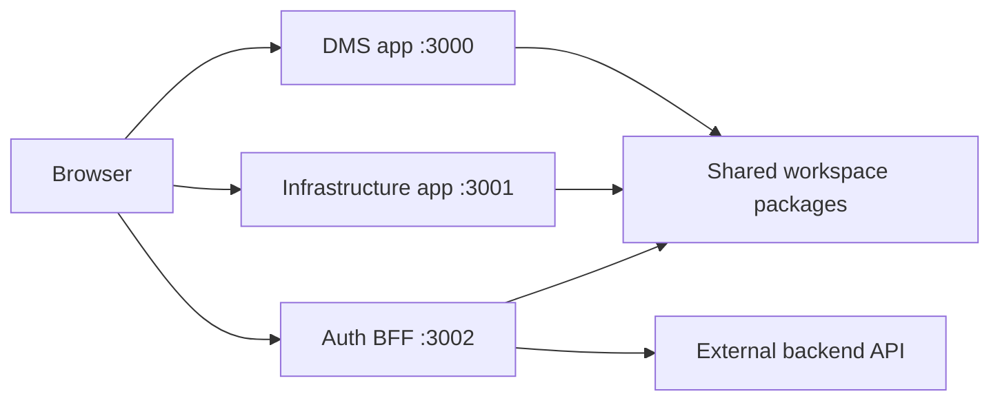
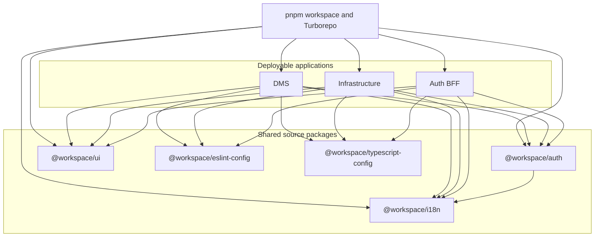
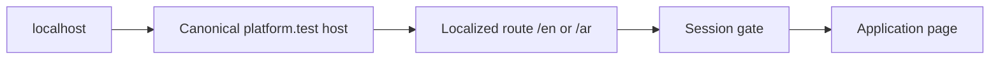

# Architecture overview

## Purpose

This repository is the foundation for a service-based business platform. It
keeps several independently runnable web applications in one source
repository while centralizing the policies and primitives that must remain
consistent.

The architecture is intentionally between a single application and fully
independent microservices:

- Each app has its own routes, runtime, port, hostname, and deployment
  boundary.
- Apps share source packages, versions, tooling, and authentication trust.
- There are no code imports from one app into another app.
- The external backend remains authoritative for business data and
  permissions.

## System at a glance

The current applications are:

- [`apps/dms`](../../apps/dms): the future document-management product. It
  currently contains a protected, localized starter page.
- [`apps/infrastructure`](../../apps/infrastructure): the future
  infrastructure product. It currently contains a protected, localized
  starter page.
- [`apps/auth`](../../apps/auth): the centralized authentication service and
  Backend for Frontend. It owns credential submission, session creation, and
  logout.

The current shared packages are:

- [`packages/auth`](../../packages/auth): server-only authentication policy,
  cookie configuration, claim validation, redirects, session readers, and
  proxy composition.
- [`packages/i18n`](../../packages/i18n): supported locales, routing,
  navigation helpers, request configuration, and shared translations.
- [`packages/ui`](../../packages/ui): shared styles and visual primitives.
- [`packages/eslint-config`](../../packages/eslint-config): repository lint
  policy.
- [`packages/typescript-config`](../../packages/typescript-config): shared
  strict TypeScript presets.

## Repository model

[`pnpm-workspace.yaml`](../../pnpm-workspace.yaml) discovers every
`apps/*` and `packages/*` workspace. Internal dependencies use the
`workspace:*` protocol, so an app always consumes the package source from
this repository rather than a separately published version.

[`package.json`](../../package.json) defines the common commands:

- `pnpm dev`: runs all applications through Turborepo.
- `pnpm build`: builds all deployable applications.
- `pnpm typecheck`: validates TypeScript across the dependency graph.
- `pnpm lint`: applies shared lint policy.
- `pnpm format`: formats workspaces through their local scripts.

[`turbo.json`](../../turbo.json) coordinates tasks and build caching. Build
tasks depend on dependency builds, while development tasks are persistent
and intentionally uncached.

The important dependency rule is one-way:

> Apps may depend on packages. Packages must not depend on apps. Apps must
> not import code from sibling apps.

This prevents DMS and infrastructure from becoming coupled through hidden
implementation details.

## Why a monorepo

The monorepo provides:

- **Atomic change sets**: an authentication contract and every consumer can
  change in one reviewed commit.
- **Consistent versions**: framework, React, lint, and TypeScript versions
  stay aligned.
- **Shared quality gates**: one command validates the whole platform.
- **Discoverability**: engineers can follow a request from app code into the
  shared contract without moving across repositories.
- **Reuse without publishing**: packages expose typed source directly to
  the apps.
- **Independent products**: repository sharing does not require a single
  runtime or hostname.

The trade-off is that repository-wide changes can affect several
deployments. Package APIs and environment contracts therefore need the same
review discipline as public APIs.

## Service-based architecture

An app in this repository is also a web service: it runs its own Next.js
server and can be deployed separately.

Local development models the intended topology:

- `dms.platform.test:3000`
- `infrastructure.platform.test:3001`
- `auth.platform.test:3002`

Loopback URLs are redirected to those canonical hostnames. Every public page
uses an explicit `/en` or `/ar` locale prefix.

The apps are independently runnable, but authentication creates an
intentional shared trust boundary. All trusted sibling subdomains receive
the parent-domain session cookie and use the same secret to read it. A new
subdomain must not be added casually.

No container, orchestration, cloud deployment, health-check, or CI manifest
currently exists in this repository. Those concerns are deployment roadmap
items, not implemented architecture.

## App versus package convention

### Code belongs in an app when

- It defines a route, layout, page, Route Handler, or server action.
- It implements one product's business workflow.
- It is tied to one deployment, hostname, or service-specific environment.
- It contains app-owned translations or metadata.
- It accepts credentials; in this platform that is restricted to the auth
  app.
- It is not yet stable or reused enough to justify a shared API.

Examples:

- [`apps/auth/auth.ts`](../../apps/auth/auth.ts) integrates the concrete
  Credentials provider and external login endpoint.
- [`apps/auth/app/[locale]/actions.ts`](../../apps/auth/app/%5Blocale%5D/actions.ts)
  owns login and logout actions.
- [`apps/dms/messages`](../../apps/dms/messages) owns DMS wording.

### Code belongs in a package when

- Two or more apps need the same behavior.
- A security or platform rule must be enforced consistently.
- It is a reusable visual primitive or design token.
- It is a typed contract with a stable, intentional export.
- It configures repository-wide developer tooling.
- It has no route or independent runtime.

Examples:

- [`packages/auth/src/cookie.ts`](../../packages/auth/src/cookie.ts) gives
  writers and readers one cookie definition.
- [`packages/i18n/src/navigation.ts`](../../packages/i18n/src/navigation.ts)
  gives every app the same locale-aware navigation API.
- [`packages/ui/src/components/button.tsx`](../../packages/ui/src/components/button.tsx)
  is a reusable visual primitive.

### Extraction checklist

Before moving app code into a package, ask:

1. Is there a second real consumer?
2. Is the behavior the same, or merely similar?
3. Can the package API avoid importing app-specific routes, data, and
   environment assumptions?
4. Who owns backward compatibility for the shared API?
5. Does sharing reduce drift, or does it create unwanted coupling?

If the answers are unclear, keep the code in the app until the abstraction
is proven.

## Request boundaries

The browser communicates with app hostnames, not directly with shared
packages. Packages execute inside each app's server or client bundle.

For protected navigation:

1. The app proxy canonicalizes localhost and locale routing.
2. The shared auth reader checks the encrypted session.
3. Anonymous requests move to the auth service with a safe `returnTo`.
4. Authenticated requests reach the localized layout.
5. The layout checks the session again near rendering.
6. Future data operations must verify authorization and let the backend
   enforce it again.

This combines an early navigation gate with a server-side boundary close to
the protected content. The proxy is not treated as the only security check.

## Scaling guidance

As the platform grows:

- Keep app-to-app communication explicit through HTTP or shared contracts,
  never source imports.
- Add domain packages only after multiple applications need a stable
  abstraction.
- Protect every future API Route Handler independently; current proxy
  matchers exclude API paths.
- Add test, observability, health-check, and deployment conventions before
  increasing the number of services.
- Review whether parent-domain SSO remains an acceptable trust model whenever
  a new team or less-trusted service is added.
- Consider versioned contracts or separate repositories only when release
  independence outweighs the benefits of atomic monorepo changes.
