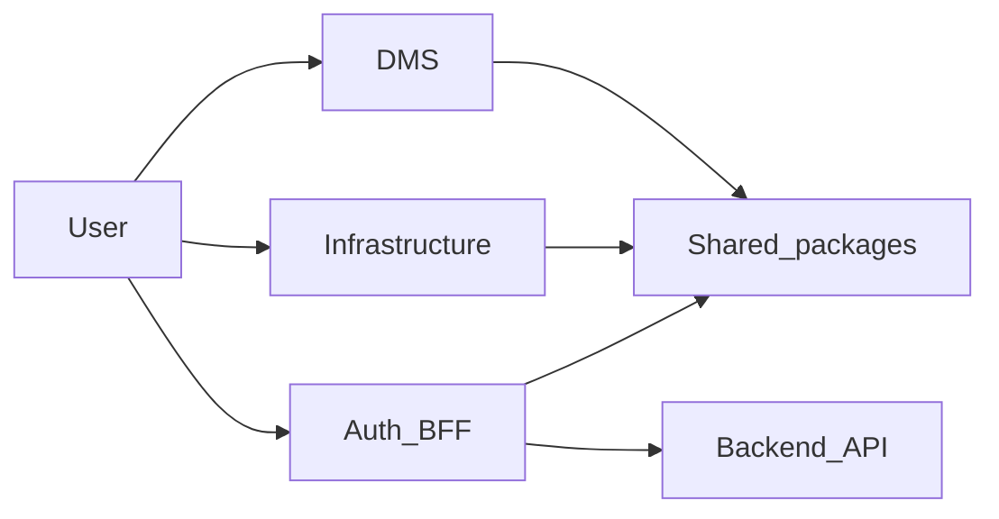
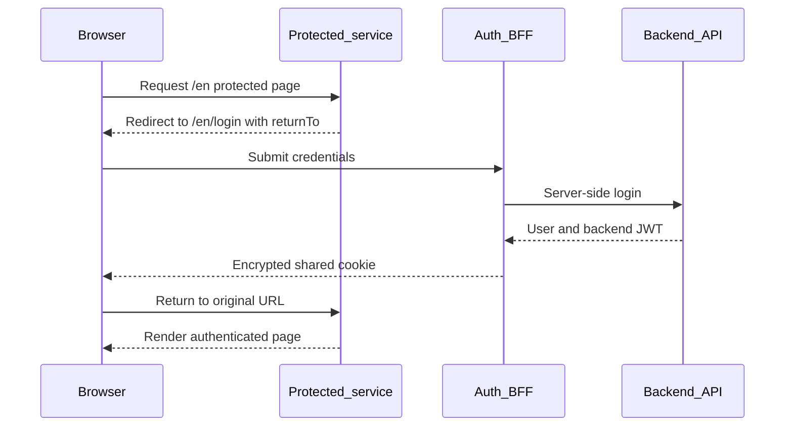

# Platform architecture presentation

## Presentation profile

- Audience: mixed technical and business stakeholders.
- Target duration: 20 minutes.
- Format: 11 slides including a short live demo.
- Goal: explain why the foundation exists, how it works, what is implemented,
  and what remains.

The central message is:

> We have built a shared platform foundation that lets DMS and
> infrastructure evolve as separate products while sharing secure
> authentication, localization, UI primitives, and engineering standards.

Do not describe DMS or infrastructure business workflows as complete. The
presentation is about platform readiness and architectural direction.

## Slide 1 — One platform, multiple products

**Time:** 1 minute

**Key points**

- Three independently runnable web services.
- One centralized identity experience.
- One repository for shared standards and atomic changes.
- English and Arabic from the foundation.

**Suggested visual**

Show three labeled boxes—DMS, Infrastructure, and Auth—inside one platform
boundary.

**Speaker notes**

“The goal is not to build one giant application. The goal is to let each
business product evolve independently without rebuilding authentication,
localization, UI foundations, and engineering standards every time.”

## Slide 2 — The problem we are solving

**Time:** 1.5 minutes

**Key points**

- DMS and infrastructure have different product roadmaps.
- Users should not authenticate separately for each trusted service.
- Shared behavior must not be copied into every app.
- Future separation should not require rewriting the platform.

**Suggested visual**

Contrast duplicated standalone apps with coordinated services sharing a
platform layer.

**Speaker notes**

“Copying auth and locale code makes early development look fast, but every
security fix and product addition creates drift. Our architecture keeps
business workflows separate and platform policy shared.”

## Slide 3 — System map

**Time:** 2 minutes

**Key points**

- DMS: protected product service on port 3000.
- Infrastructure: protected product service on port 3001.
- Auth BFF: credential and session authority on port 3002.
- External backend: source of identity and permissions.
- Shared packages execute inside the applications; they are not separate
  network services.

**Suggested visual**

**Speaker notes**

“The boxes under `apps` are deployable services. The boxes under `packages`
are shared source and policy. A package does not have a URL or deployment of
its own.”

## Slide 4 — Why a monorepo

**Time:** 1.5 minutes

**Key points**

- pnpm manages apps and packages as one workspace.
- Turborepo coordinates builds and quality checks.
- Shared changes can update producers and consumers atomically.
- Framework and tooling versions remain aligned.
- Each app still has its own runtime and deployment boundary.

**Suggested visual**

Show one repository branching into three deployment artifacts.

**Speaker notes**

“Monorepo does not mean monolith. It describes source-code organization, not
runtime topology. We gain coordinated changes while keeping separate
services.”

## Slide 5 — What is an app, service, or package?

**Time:** 1.5 minutes

**Key points**

- **App/service**: owns routes, business workflows, runtime configuration,
  hostname, and deployment.
- **Package**: owns reusable policy, types, UI, navigation, or tooling.
- Apps depend on packages.
- Packages do not import apps.
- Sibling apps do not import each other.

**Suggested visual**

Use a downward dependency diagram from apps to packages.

**Speaker notes**

“A page belongs to DMS. The rule that every trusted app reads the same cookie
belongs in a package. We extract code because behavior must be shared, not
only because two files look similar.”

**Example to mention**

- `apps/auth/auth.ts` owns the concrete login integration.
- `packages/auth/src/session.ts` owns reusable session-reading policy.
- `packages/i18n` owns locale navigation.
- `packages/ui` owns reusable visual primitives.

## Slide 6 — Authentication choices

**Time:** 2 minutes

**Key points**

- Database sessions provide central revocation but require shared storage.
- Signed JWTs are stateless but readable and hard to revoke.
- Encrypted JWE sessions keep browser payloads confidential.
- OAuth/OIDC supports identity federation but requires an identity provider.
- Credentials plus BFF fits the backend API available today.

**Suggested visual**

Use a horizontal spectrum:

`Credentials → Auth BFF → Encrypted session → Trusted services`

**Speaker notes**

“We are not putting the backend JWT directly into JavaScript. The backend
token is stored inside an encrypted, HttpOnly Auth.js session. This choice
works with the current backend while leaving OIDC as a future evolution.”

## Slide 7 — Implemented SSO flow

**Time:** 3 minutes

**Key points**

- DMS and infrastructure do not process passwords.
- Anonymous users are redirected to one localized auth app.
- The BFF validates the backend user and token.
- One parent-domain session works across trusted sibling services.
- The original localized path and query are restored.
- Central logout invalidates access to every protected service.

**Suggested visual**

**Speaker notes**

“The proxy is the early navigation gate. The protected layout checks again
near rendering. Future backend actions must also check authorization, and
the backend remains the final authority.”

**Security points to mention**

- Exact-origin redirect allowlist.
- Inactive, expired, malformed, and mismatched identities are rejected.
- Backend token is excluded from the browser session API.
- Cookie is `HttpOnly`, `SameSite=Lax`, and secure in HTTPS production.

## Slide 8 — Localization and shared experience

**Time:** 1.5 minutes

**Key points**

- Every URL explicitly uses `/en` or `/ar`.
- Arabic pages use RTL direction and Arabic typography.
- Each app owns its product messages.
- Shared messages are merged from the i18n package.
- Shared navigation preserves locale and query state.
- Canonical subdomains model the deployment experience locally.

**Suggested visual**

Show the same page represented at `/en` and `/ar`, with arrows indicating
direction change.

**Speaker notes**

“Localization is not added at the end. Routing, metadata, fonts, direction,
navigation, and message ownership are already part of the app contract.”

## Slide 9 — Live demo

**Time:** 2.5 minutes

**Goal**

Demonstrate platform foundations, not unfinished domain workflows.

**Demo sequence**

1. Open `http://dms.platform.test:3000/en` in a private browser window.
2. Show the redirect to localized auth with the DMS URL in `returnTo`.
3. Sign in once.
4. Show return to DMS without exposing the backend token.
5. Open `http://infrastructure.platform.test:3001/en` and show that another
   password is not required.
6. Switch to Arabic and point out `/ar`, RTL direction, and preserved query
   parameters.
7. Use centralized logout and refresh both product apps.

**Demo preparation**

- Start all apps with `pnpm dev`.
- Confirm `/etc/hosts` entries.
- Confirm all `.env.local` files share the same auth secret.
- Use a non-sensitive demo account.
- Clear platform cookies before rehearsal.
- Keep screenshots available in case the backend or network is unavailable.

**Speaker notes**

“The important outcome is one identity journey across separate products.
The pages are starter shells; the reusable platform behavior is the feature
being demonstrated.”

## Slide 10 — Honest risks and roadmap

**Time:** 2 minutes

**Current trade-offs**

- All secret-holding sibling services share one authentication trust
  boundary.
- Backend JWT claims are decoded but not signature/issuer/audience verified
  locally.
- Permissions are snapshots until backend-token expiry.
- There is no refresh, revocation, automated auth testing, or observability.
- Future API routes need explicit authentication and authorization.
- DMS and infrastructure business workflows are not implemented.

**Next steps**

1. Add auth and routing integration tests.
2. Add backend JWT cryptographic verification.
3. Build a server-only backend API client.
4. Enforce modules and permissions in product operations.
5. Add shared application shell and complete RTL/theme behavior.
6. Add deployment, health, audit, and observability conventions.
7. Implement DMS and infrastructure domain workflows.

**Suggested visual**

Use three roadmap stages: harden foundation, build shared shell, deliver
domain workflows.

**Speaker notes**

“This architecture is a strong foundation, not a claim of production
completion. Calling out the boundaries now makes the next investment
decisions clear.”

## Slide 11 — Closing

**Time:** 1 minute

**Key points**

- Separate products, shared platform standards.
- Central credentials and encrypted SSO.
- Localization and RTL built into routing.
- Clear app/package boundaries support future scaling.
- The next milestone is hardened backend integration and domain delivery.

**Closing statement**

“We can now add product capabilities without duplicating the platform
foundation. The architecture gives us a controlled path from starter apps
to independently deployable, secure business services.”

## Likely questions and answers

### Is this a microservices architecture?

It is a service-based frontend architecture. Each app is independently
runnable and deployable, but the apps share source packages and an
authentication trust boundary. Calling it fully independent microservices
would overstate the current isolation.

### Is a monorepo the same as a monolith?

No. A monorepo is a source-control choice. DMS, infrastructure, and auth run
as separate servers and can produce separate deployment artifacts.

### Why is auth both an app and a package?

The auth app is the deployable credential and session authority. The auth
package is reusable server-only policy consumed by several apps. One has a
URL; the other does not.

### Why not place everything in shared packages?

Sharing too early creates coupling and generic APIs that fit no product
well. Business workflows remain in their owning apps. Only stable,
cross-service behavior becomes a package.

### Why not use OAuth or OIDC?

The available backend currently exposes a Credentials login API. The BFF
adapts that contract safely. OIDC is the recommended evolution when an
identity provider and federation requirements are available.

### Can one compromised sibling app affect the others?

Yes. Apps with the shared secret and parent-domain cookie are inside one
trust boundary. That is acceptable only for jointly controlled services
with equivalent security standards.

### Is the backend token visible in the browser?

It exists inside the encrypted HttpOnly Auth.js cookie, but it is omitted
from `/api/auth/session` and client props. Client JavaScript cannot read the
cookie directly.

### Where should new API integrations live?

Service-specific orchestration belongs in the owning app's server code.
Stable backend client and policy primitives can move to a package when
multiple apps need the same contract.

### Are permissions enforced now?

The session validates and exposes module/permission snapshots server-side,
but product operations do not exist yet. Every future action and Route
Handler must check entitlements, and the backend must authorize again.

### Can each application deploy separately?

Yes at the Next.js application level. The repository does not yet include
deployment manifests or CI pipelines, so the production automation still
needs to be defined.

### What is complete today?

The monorepo structure, independent app runtimes, centralized credentials
flow, shared encrypted SSO, localization, RTL foundations, canonical local
domains, and shared package boundaries.

### What is not complete today?

The DMS and infrastructure business workflows, automated tests, hardened
backend token verification, refresh/revocation, observability, deployment
automation, and a complete shared application shell.

## One-minute backup version

If time is cut short:

“The platform has three independently runnable Next.js services in one pnpm
and Turborepo workspace: DMS, infrastructure, and a centralized auth BFF.
Shared packages provide authentication policy, localization, UI, and
tooling. Users log in once; Auth.js stores the backend credential inside an
encrypted HttpOnly parent-domain session accepted by both protected apps.
Every route is explicitly English or Arabic, including RTL support. The
foundation is implemented, while domain workflows, automated tests,
cryptographic backend-token verification, and deployment automation are the
next milestones.”
